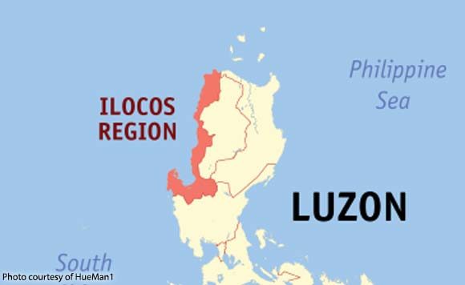
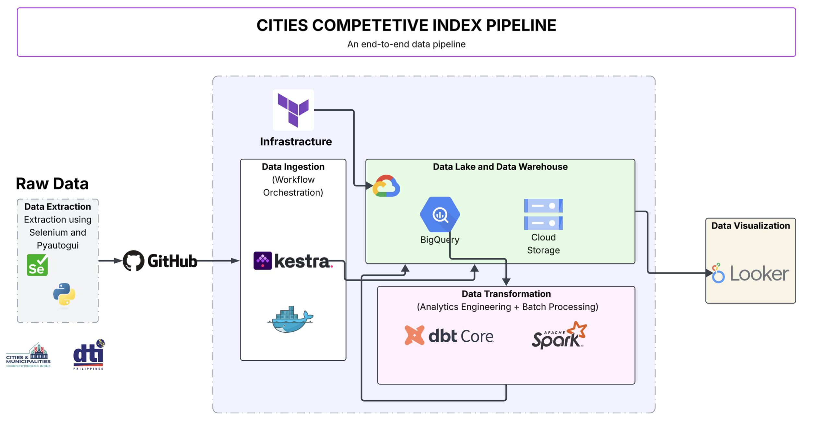
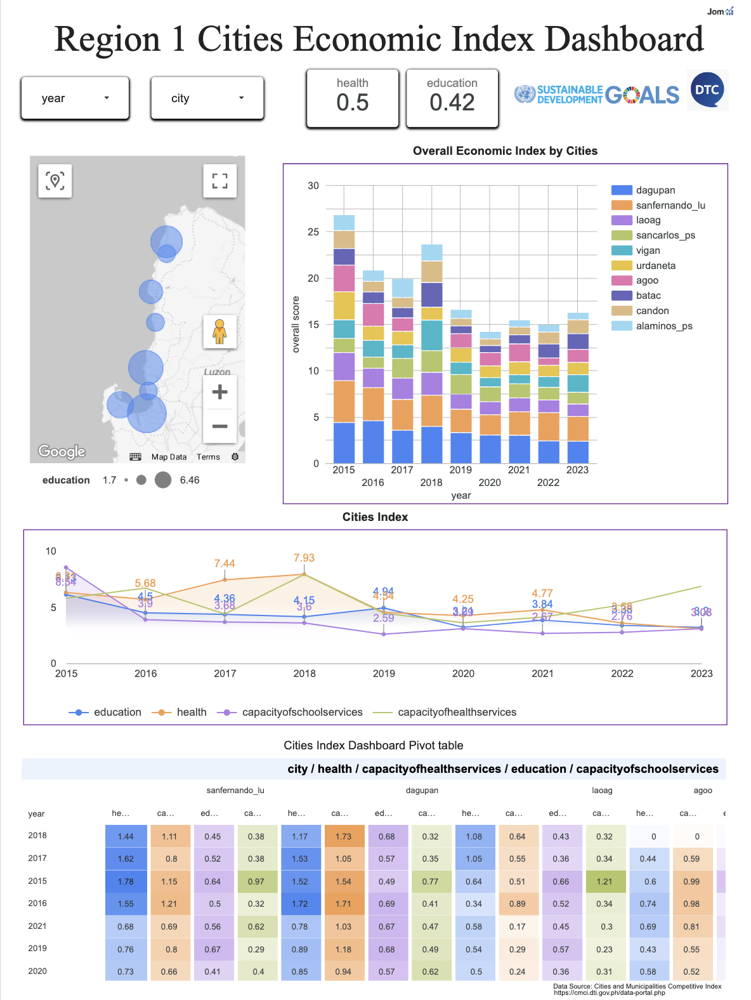

<h1 align="center">
    <strong>A Data-Driven Economic Index for Assessing Urban Development in the Ilocos Region, Philippines</strong>
</h1>

<p align="center">
  
</p>


## 1. The Problem
**Metro Manila vs. the Rest:** A huge portion of economic activities in the Philippines are still concentrated in Metro Manila and a few other urban centers like Cebu in Visayas and Davao in Mindanao. Many regions remain underdeveloped and struggle to attract investment.

On this dashboard we will see the economic indexes of the cities in Region 1. These are Laoag and Batac in Ilocos Norte, Vigan and Candon in Ilocos Sur, San Fernando and Agoo in La Union, and Dagupan, Alaminos, San Carlos, and Urdaneta in Pangasinan. 

The goal of this project is to visualize which cities in Region 1 are leading or lagging. This enables the government for benchmarking and best practice sharing, targeted support or funding and also healthy competition among LGUs.

## 2. Data Source

This project utilizes the open source data of the Department of Trade and Industry (DTI). It is an annual ranking of Philippine cities and municipalities developed by the National Competitiveness Council through the Regional Competitiveness Committees (RCCs) with the assistance of the United States Agency for International Development.

Data Soure:
https://cmci.dti.gov.ph/data-portal.php

I used Selenium and PyautoGUI to crawl and extract the data of the 10 cities.


## 3. Data Architecture

<p align="center">
  
</p>


The overall data pipeline is designed to fetch, process, store, and visualize 9 years worth of cities data using modern open-source tools and cloud services. The architecture leverages Docker containers for Kestra as the orchestrator, Google Cloud Bucket for data lake, BigQuery for data warehouse, dbt for data transformation, spark for complex transformation, and Looker Studio for visualization.

### Technology Used
- **Python:** Programming language used for scripting
- **Kestra:** Used as a workflow orchestrator for data ingestion
- **Google Cloud Storage:** For storing raw and processed data
- **BigQuery:** Data warehouse for storing cleaned and transformed data
- **dbt:** Data transformation tool to create models making sure it is repeatable and scallable
- **spark:** Used for complex transformation
- **Terraform:** Infrastructure as Code (Iac) tool to manage cloud resources
- **Docker:** for containerization

The pipeline follows a batch processing workflow, orchestrated end-to-end using Kestra and built entirely on Google Cloud Platform with Infrastructure as Code:

1. **Data Ingestion:** The Region 1 cities csv files are uploaded via [github](https://github.com/pyjom/Region-1-Cities-Economic-Index-Pipeline/tree/main/data).
 You can download csv files using the [CMCI data portal](https://cmci.dti.gov.ph/data-portal.php) and choose the cities you want to analyzed. However, I used Selenium and Pyautogui to automate the downloading of csv files, I will add additional information regarding my data extraction (web scraping)soon.

2. **Orchestration:** Kestra, containerized with Docker, orchestrates the processing of each city from downloading of csv files from github, uploading this file to google cloud storage, creating a bigquery table for each city, then loading the data inside the created table. 

3. **Data Warehouse:** Raw data is loaded from GCS into Google BigQuery’s staging dataset (`test_dataset_kestra`) following this format (`city_raw`) . Clustering and Partitioning are not yet utilized because each city with 8 years worth of data has only 3.5 KB in file size.

4. **Transformations:** dbt core is used to clean the 10 raw table (`city_transformed`) and aggregate and merged it into one table (`unified_cities`). 
    - Spark is utilized in the next stage for much more complex transformation, which will then be used for a production-ready dataset for machine learning purposes (`production.transformed_dataset`) .   
5. **Visualization:** The final dataset is visualized using Looker Studio, providing interactive dashboards to explore the top 4 most important economic index in a city (health, school, capacity of health services, capacity of school services)

6. **Infrastructure as Code (IaC):** The GCS bucket and BigQuery datasets are provisioned using Terraform to ensure reproducibility and scalability. Use Terraform to provision the GCS  and  as Infrastructure as Code (IaC).


### Dashboard
<p align="center">
  
</p>

The dashboard, titled **Region 1 Cities Economic Index Dashboard**, visualizes key metrics from the Citi Bike 2024 dataset:
- **Health:** The average index of health in the Philippines' region 1 is 0.5. 
- **Education:** The average index of education in the Philippines' region 1 is 0.42.
- **Philippines' region 1 map:** A bubble map using circles of different size to represent the index. 
- **Cities Index:** A line graph showing the growth of the four indexes through time. For health and capacity of health services indexes, they had a positive growth from 2015 until 2018 but it started to plummet after 2019.

- **Cities Index Dashboard Pivot Table:** A pivot table to see the transformed data for each city and each index. 

The dashboard is accessible via [Looker Studio link](https://lookerstudio.google.com/reporting/ef3a013b-e5c4-4b4f-a7a4-ddd57045877e).

## **4. Project Prerequisites**

- Google Cloud Platform (GCP) account and GCP service account key (one for terraform, dbtcore, kestra, and spark)
- Google Cloud SDK 
- Anaconda
- Terraform installed for Infrastructure as Code (IaC) 
- Kestra
- Dbt core
- Spark (Java and Hadoop)
- Docker and docker compose


I suggest to use Virtual Machine so that any changes you will make will not affect your local machine. 

### Steps to Run

1. **Clone the Repository**
   ```bash
   git clone git@github.com:pyjom/Region-1-Cities-Economic-Index-Pipeline.git
   cd Region-1-Cities-Economic-Index-Pipeline
   ```

2. **Set Up GCP**
- Create a GCP project and enable the necessary APIs (Storage, BigQuery, Compute Engine, IAM).

- Generate a service account key with permissions for GCS and BigQuery, and save it as json file

3. **Provision Infrastructure with Terraform**
- Navigate to the terraform/ directory.
- Update variables.tf with your GCP project ID, region, and bucket name.
 ``` bash
cd terraform/infra
terraform init       # Initializes the working directory
terraform plan       # Shows the execution plan
terraform apply      # Applies the changes and creates the infrastructure
 ```

4. **Setup Kestra**
  - kestra/docker-compose.yml mounting volumes, reorganize paths
 ```bash
    cd kestra
    docker-compose up
```
- Run first the kestra_key_value.yml for the variable, then gcp_setup.yml for the gcp setup, lastly run the kestra_to_gcp. This will download the data, store it to gcs, create a bigquery table and insert the data into this table.   

5. **Transform Data with dbt core**
- In setting dbt core, you need to create a python virtual environment
 ``` bash
 python -m venv <name>
  ```
- Activate the venv then install dbt-core
 ``` bash
pip install dbt-core dbt-bigquery, sqlfmt 
  ```
  - Run the dbt models to create (`unified_cities`) table inside bigquery
   ``` bash
dbt debug
dbt build 
  ```

6. **Transform Data with spark**
  ``` bash
export PYTHONPATH="${SPARK_HOME}/python/:$PYTHONPATH"
export PYTHONPATH="${SPARK_HOME}/python/lib/py4j-0.10.9.5-src.zip:$PYTHONPATH"
cd spark_transformation
mv /path/to/spark-bigquery-with-dependencies_2.12-0.29.0.jar $SPARK_HOME/jars/
python3 table_to_bucket.py
python3 spark-transformation.py

  ```


  7. **Visualize in Looker Studio**
- Connect Looker Studio to the (`production.transformed_dataset`) dataset in BigQuery.
- Recreate the dashboard as shown above, or use the provided [Looker Studio link](https://lookerstudio.google.com/reporting/ef3a013b-e5c4-4b4f-a7a4-ddd57045877e).


## Challenges and Learnings
- Challenge: More than half of my total project time was dedicated in learning dbt Cloud and dbt Core. This includes jinja templating, macros, and dbt fundamentals. Big thanks to [Sleek Insights](https://www.youtube.com/watch?v=b2nSMPiXdXk&list=PLc2EZr8W2QIBegSYp4dEIMrfLj_cCJgYA) for the wonderful youtube tutorials! Although, not a part of the curriculum, I also spent a lot of time creating the selenium and pyautogui script for automatically downloading csv files per cities. 

- Learning: Except SQL and Pyspark, most of the topics and tools are new to me. I really enjoyed Virtual Machine and its capability as well as Kestra. I am  guilty for not fully learning Kestra because only small percentage of companies use it.  
- Insight: Region 1 is stagnant and needs a major revamp to wake its economic potentials.

## Future Improvements and Plans
- Implement a CI/CD pipeline for automated deployments.
- This is a stepping stone in creating machine learning models that could solve United Nation's Sustainable Development Goals. 


## Acknowledgments
A massive thanks to [Alexey Grigorev](https://www.linkedin.com/in/agrigorev/) and the [DataTalksClub](https://github.com/DataTalksClub) team for providing this incredible opportunity and for making this happen through the Data Engineering Zoomcamp 2025. To all the instructors for giving their time and sharing their expertise, thank you. As well as the community in slack. 

Feel free to reach out on [LinkedIn](https://www.linkedin.com/in/john-jomari-arubio-850594232/) or shoot me an email at jomariarubio@gmail.com! 

See you again, soon! 